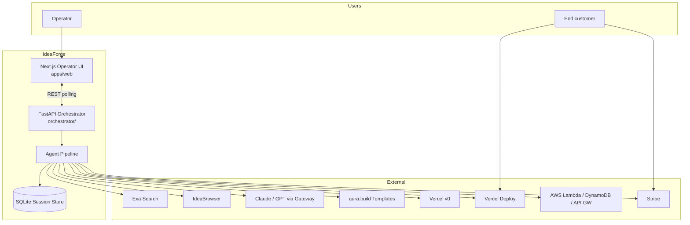
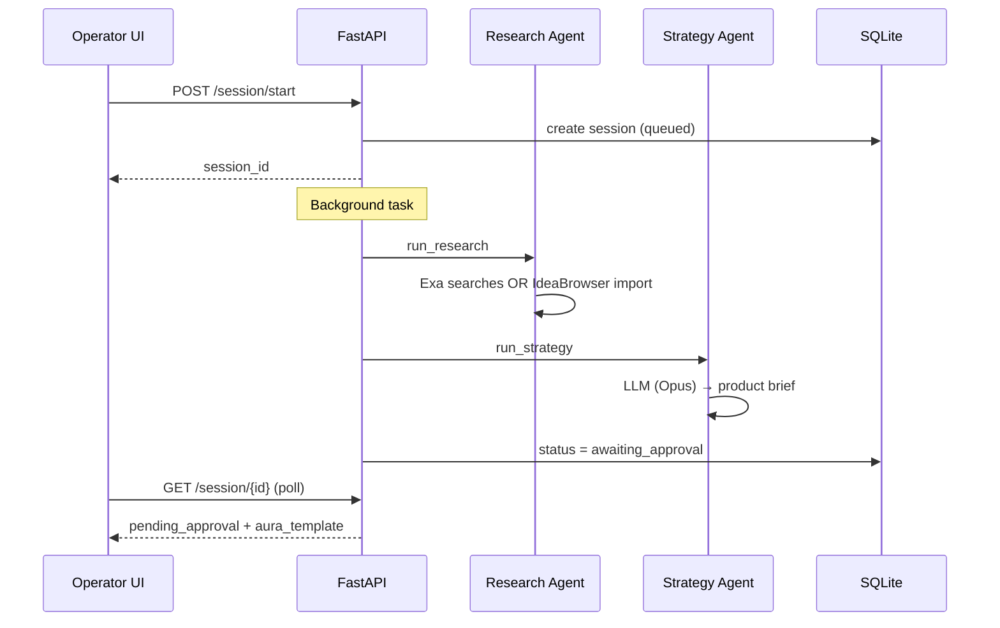
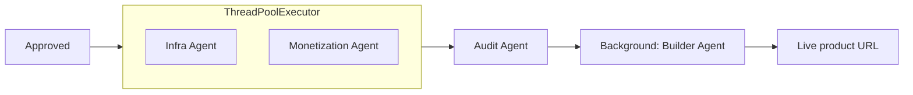
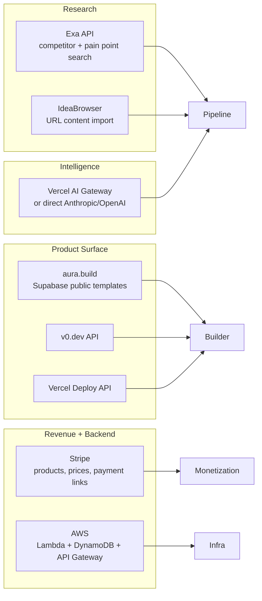
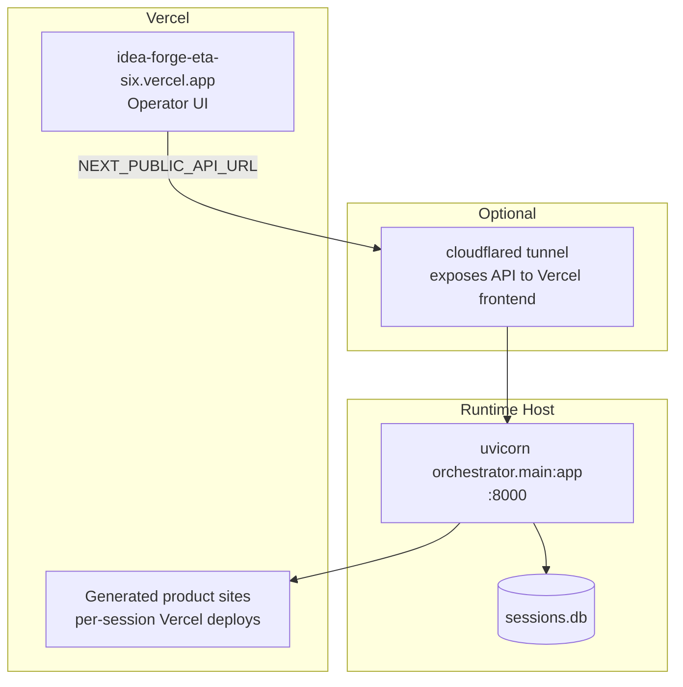

# IdeaForge Platform Architecture

> **IdeaBrowser shows you what to build. IdeaForge builds it.**

IdeaForge (Superai) is an autonomous agent pipeline that turns business ideas into live, monetized SaaS products. A human operator submits an idea (or IdeaBrowser URL), reviews a strategy brief, approves, and receives a deployed product with Stripe checkout and an audit trail of every decision.

**Live operator app:** https://idea-forge-eta-six.vercel.app  
**Marketing site:** `ideaforge-website.html` (standalone static HTML)

---

## 1. System Context



---

## 2. Architectural Pattern

| Layer | Responsibility |
|-------|----------------|
| **Operator UI** | Command bar, pipeline progress, strategy approval, live product links |
| **API Gateway** | FastAPI — session lifecycle, health, CORS, background tasks |
| **Orchestrator** | Stateful pipeline supervisor with human-in-the-loop checkpoint |
| **Specialist Agents** | Research, strategy, build, infra, monetization, audit |
| **Tool Adapters** | Thin wrappers around Exa, Stripe, Vercel, aura.build, AWS |
| **Persistence** | SQLite JSON blob per session; optional static snapshots for Vercel-only deploy |

The orchestrator follows a **supervisor → specialist agents → audit trail** pattern. LangGraph is listed in `requirements.txt` as a dependency; the current implementation uses a custom threaded pipeline in `orchestrator/pipeline.py` rather than a LangGraph graph definition.

---

## 3. Repository Layout

```
Superai/
├── orchestrator/           # FastAPI app, pipeline, state, LLM, persistence
│   ├── main.py             # HTTP API entrypoint
│   ├── pipeline.py         # Pre/post-approval pipeline + resume logic
│   ├── state.py            # AgentState TypedDict
│   ├── store.py            # SQLite session persistence
│   ├── llm.py              # Multi-tier LLM client (fast / strategy / builder)
│   ├── api_view.py         # Strips internal fields from API responses
│   ├── complexity.py       # Time/complexity estimates
│   ├── progress.py         # Progress log + heartbeat
│   └── stage_log.py        # Structured JSON logging
│
├── agents/                 # Specialist agent runners
│   ├── research_agent.py   # Exa + IdeaBrowser import
│   ├── strategy_agent.py   # Product decisions (niche, ICP, pricing)
│   ├── builder_agent.py    # aura.build remix or v0 generation + deploy
│   ├── infra_agent.py      # AWS resource metadata
│   ├── monetization_agent.py
│   └── audit_agent.py      # Final decision brief
│
├── tools/                  # External service adapters
│   ├── exa_tools.py
│   ├── ideabrowser_tools.py
│   ├── aura_build_client.py    # Fetch public aura.build HTML via Supabase RPC
│   ├── aura_build_tools.py     # Remix + deploy pipeline
│   ├── aura_html_tools.py      # Legacy static HTML path
│   ├── aura_portfolio.py       # Template selection from config
│   ├── v0_tools.py
│   ├── vercel_tools.py
│   ├── stripe_tools.py
│   └── aws_tools.py
│
├── config/
│   └── aura_portfolio.json     # 20 aura.build templates with slugs
│
├── apps/web/               # Next.js 15 operator dashboard
│   └── src/
│       ├── app/            # Routes: /, /history, /api/transcribe
│       ├── components/     # Dashboard, approval modal, pipeline UI
│       └── lib/            # api.ts, session-view.ts, product-url.ts
│
├── data/                   # sessions.db (gitignored)
├── tests/
├── scripts/                # start-all, deploy, Stripe wiring
├── ideaforge-website.html  # Marketing landing page
└── requirements.txt
```

---

## 4. Agent Pipeline

### 4.1 Pre-approval (automatic)



| Agent | Input | Output | External deps |
|-------|-------|--------|---------------|
| **Research** | `user_input` or `ideabrowser_url` | `market_research`, competitors, pain points | Exa, IdeaBrowser scrape |
| **Strategy** | Research + idea | `product_name`, niche, ICP, features, pricing, `pending_approval` | Claude Opus (strategy tier) |

### 4.2 Human checkpoint

The operator reviews the strategy brief in a full-screen approval modal. They can **Approve** or **Adjust strategy** (feedback loop, max 3 retries).

`POST /session/{id}/approve` with `{ approved, feedback }` triggers the post-approval pipeline.

### 4.3 Post-approval (parallel + background)



| Step | Agent | Behavior |
|------|-------|----------|
| Parallel deploy | Infra + Monetization | AWS metadata + Stripe product/prices/checkout links run concurrently |
| Finalize | Audit | Compiles `final_brief` markdown from audit log |
| Background UI | Builder | aura.build remix (default) or v0; deploys to Vercel; wires Stripe redirects when ready |

**FAST_MODE:** Skips UI generation entirely; Stripe + AWS metadata only.

**UI builder resolution** (`tools/aura_portfolio.resolve_ui_builder`):

| `UI_BUILDER` | Path |
|--------------|------|
| `aura` (default) | Fetch template HTML → LLM remix → static deploy via Vercel |
| `v0` | Vercel v0 chat API → full Next.js app generation |
| `auto` | Prefer aura when portfolio match exists |

---

## 5. Session State Machine

```
queued
  → researching → researched
  → (strategy) → awaiting_approval
       ↓ approve                    ↓ reject (≤3x)
  building → generating_ui    revising_strategy → awaiting_approval
       ↓                              ↓ (>3 retries)
  complete / complete_with_warnings   rejected
       ↓ error
     error (resumable)
```

**Terminal states:** `complete`, `complete_with_warnings`, `rejected`, `error`

**Resumability:** Interrupted sessions auto-resume on API startup (`auto_resume_interrupted`) unless `DISABLE_AUTO_RESUME=true`. UI generation (`v0_status: pending|error`) can be retried via `POST /session/{id}/resume`.

---

## 6. API Surface

Base URL: `http://localhost:8000` (dev) or tunneled via Cloudflare (`start-all.sh`)

| Method | Path | Purpose |
|--------|------|---------|
| `GET` | `/health` | Liveness + AWS credential check |
| `POST` | `/session/start` | Create session, queue pre-approval pipeline |
| `GET` | `/session/{id}` | Poll session state (sanitized via `api_view`) |
| `POST` | `/session/{id}/approve` | Human approval / rejection |
| `POST` | `/session/{id}/resume` | Resume interrupted build |
| `GET` | `/sessions` | List all session summaries |
| `GET` | `/aura/templates` | Aura portfolio catalog |
| `POST` | `/admin/deploy-web` | Redeploy operator panel to Vercel |

> **Note:** Endpoints are not versioned (`/v1/`) today. Enterprise target should add `/v1/` prefix, auth, and rate limiting.

### AgentState (core fields)

Defined in `orchestrator/state.py`. Key groups:

- **Identity:** `session_id`, `user_input`, `input_mode`, `status`, `current_step`
- **Research:** `market_research`, `competitors`, `pain_points`, `demand_signals`
- **Strategy:** `product_name`, `niche`, `icp`, `features`, `price_points`, `pending_approval`
- **Build:** `aura_template`, `ui_builder`, `vercel_deployment_url`, `final_url`, `v0_status`
- **Infra:** `aws_api_url`, `aws_stack_name`, `aws_status`, `aws_skip_reason`
- **Monetization:** `stripe_product_id`, `stripe_payment_link`, `stripe_free_payment_link`
- **Governance:** `audit_log[]`, `final_brief`, `human_approved`, `human_feedback`

---

## 7. Frontend Architecture

**Stack:** Next.js (App Router), React, Tailwind, shadcn/ui, Bun

**Routes:**

| Route | Component | Purpose |
|-------|-----------|---------|
| `/` | `IdeaForgeDashboard` | Main operator flow |
| `/history` | `BuildsLibrary` | Past forges list |
| `/api/transcribe` | Route handler | Whisper voice input |

**State-driven UI** (`lib/session-view.ts`):

| Session state | UI shown |
|---------------|----------|
| Idle | Hero + command bar |
| Building | Compact header + pipeline activity |
| `awaiting_approval` | Full-screen strategy approval modal |
| Complete | Success banner + live product card + activity panel |

**API client** (`lib/api.ts`):

- Polls `NEXT_PUBLIC_API_URL` (default `localhost:8000`)
- Falls back to bundled `history-snapshot.json` and `session-states/*.json` when API unreachable (Vercel-only frontend deploy)

**Deployment:** Vercel project `idea-forge` — frontend only; orchestrator runs separately (local, VM, or tunnel).

---

## 8. External Integrations



### aura.build integration

1. `aura_build_client.fetch_template_html(slug)` — RPC to aura Supabase `get_public_shared_code_by_slug`
2. `aura_portfolio.select_aura_template()` — scores 20 templates in `config/aura_portfolio.json`
3. `aura_build_tools.build_and_deploy_aura_product()` — fast string replacements + LLM remix → `deploy_static_html` on Vercel
4. Stripe checkout URLs wired into CTA links post-deploy

---

## 9. Persistence & Observability

| Concern | Implementation |
|---------|----------------|
| **Session store** | SQLite (`data/sessions.db`), full `AgentState` JSON per row |
| **In-memory cache** | `_sessions` dict in `pipeline.py`, hydrated on startup |
| **Progress** | `progress_log[]` + `last_heartbeat` on each step |
| **Audit** | Append-only `audit_log[]` per agent decision |
| **Logging** | Structured JSON via `stage_log.py` (`LOG_LEVEL`, optional `LOG_FILE`) |
| **Static snapshots** | `apps/web/public/history-snapshot.json`, `session-states/*.json` for offline UI |

---

## 10. Deployment Topology



**Local dev:**

```bash
bun run dev:web      # Next.js on :3000
bun run dev:api      # FastAPI on :8000
bun run start        # screen sessions + optional Cloudflare tunnel
```

---

## 11. LLM Tiering

Configured via `.env` (`orchestrator/llm.py`):

| Tier | Default model | Used by |
|------|---------------|---------|
| `fast` | claude-haiku-4.5 | Quick JSON tasks |
| `strategy` | claude-opus-4.8 | Strategy agent |
| `builder` | gpt-5.5 | UI remix / v0 prompts |

Routes through Vercel AI Gateway when `VERCEL_AI_GATEWAY_URL` + `AI_GATEWAY_API_KEY` are set; falls back to direct Anthropic/OpenAI.

---

## 12. Security & Enterprise Readiness

### Current state (hackathon MVP)

- Single-tenant, no authentication on API
- No `org_id` tenant scoping
- Secrets in `.env` (gitignored)
- CORS restricted to localhost + production web origin
- Human approval gate before deploy (governance checkpoint)
- Append-only audit log per session

### Target enterprise gaps

| Requirement | Status |
|-------------|--------|
| Multi-tenancy (`org_id`, RLS) | Not implemented |
| JWT auth + RBAC | Not implemented |
| API versioning `/v1/` | Not implemented |
| Rate limiting | Not implemented |
| Async job queue (Redis/Kafka) | Background threads only |
| Real-time updates (SSE/WebSocket) | Polling only |
| Encrypted API keys at rest | Env vars only |
| Hash-chain audit export | Plain audit log |
| Full AWS CDK deploy | Infra agent sets metadata; CDK stack in spec, not wired |

---

## 13. Key Environment Variables

| Variable | Purpose |
|----------|---------|
| `EXA_API_KEY` | Market research |
| `ANTHROPIC_API_KEY` / `OPENAI_API_KEY` | LLM calls |
| `UI_BUILDER` | `aura` \| `v0` \| `auto` |
| `V0_API_KEY` | v0 generation (when `UI_BUILDER=v0`) |
| `VERCEL_TOKEN` | Deploy generated products + control panel |
| `STRIPE_SECRET_KEY` | Product + checkout creation |
| `AWS_*` | Infra provisioning (`AWS_SKIP_INFRA=true` to skip) |
| `FAST_MODE` | Skip UI generation |
| `SESSION_DB_PATH` | Override SQLite location |
| `NEXT_PUBLIC_API_URL` | Frontend → orchestrator URL |
| `WEB_ORIGIN` | CORS allowlist for production UI |

See `.env.example` for the full list.

---

## 14. Testing

```bash
# Python (from project root with venv active)
PYTHONPATH=. pytest tests/

# Key test files
tests/test_aura_build_client.py   # aura template fetch (integration gated)
tests/test_aura_portfolio.py      # template selection
tests/test_v0_deploy.py           # v0 deploy helpers

# Frontend
bun run build:web
bun run lint:web
```

---

## 15. Design Principles

1. **Human-in-the-loop** — Strategy is never deployed without explicit approval.
2. **Degraded continuation** — Agent failures log to audit and continue where possible; pipeline does not hard-fail on non-critical steps.
3. **Checkpoint resume** — Sessions persist to SQLite; interrupted builds resume from last completed agent.
4. **Explainability** — Every agent appends to `audit_log` with decision, rationale, and sources.
5. **Parallel where safe** — Stripe + AWS run concurrently; UI builds in background after monetization.

---

*Last updated: June 2026 — reflects codebase as implemented in Superai/IdeaForge.*
